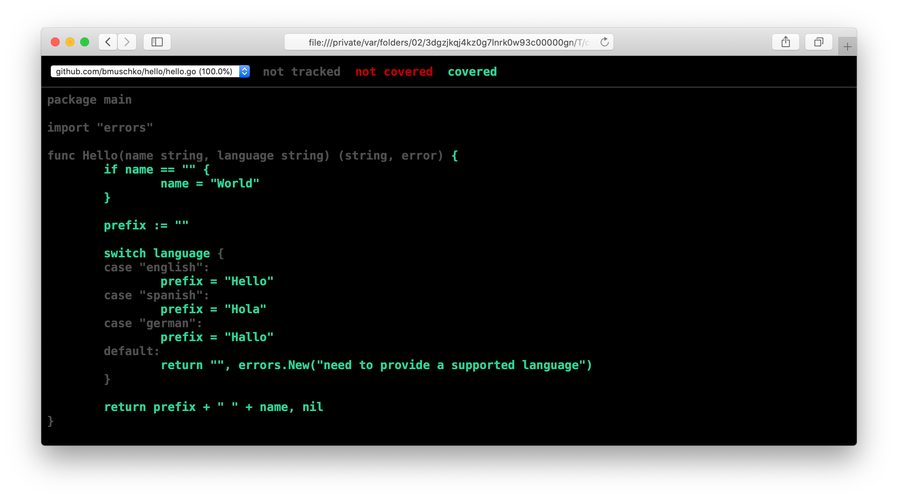
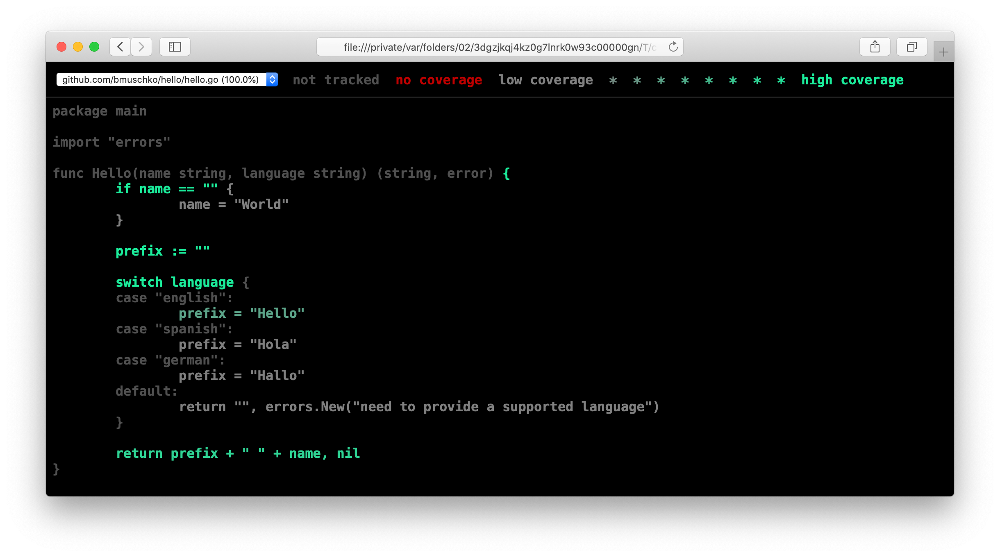
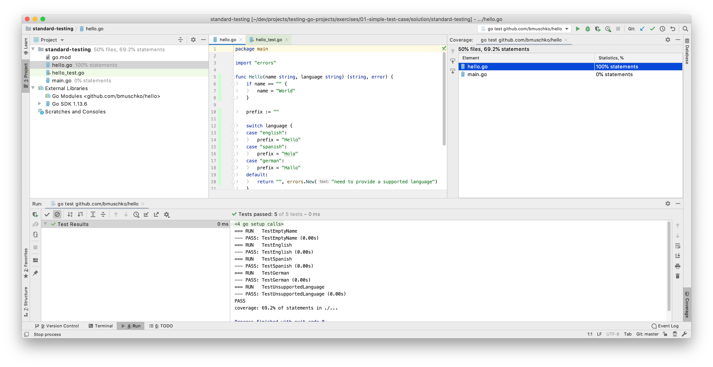

# Solution

Execute the test cases with the following command line options to generate code coverage metrics. You should see the percentage of statements covered.

```shell
$ go test ./... -coverprofile=coverage.txt
ok  	github.com/bmuschko/hello	0.232s	coverage: 69.2% of statements
```

To inspect the metrics line by line, use the `cover` command to generate a HTML report.

```shell
$ go tool cover -html=coverage.txt
```

The `hello.go` file should be covered 100%, whereas `main.go` isn't covered at all.



You should see a slightly different presentation of the metrics if you generated them with the CLI option `-covermode=count`.

```shell
$ go test ./... -coverprofile=coverage.txt -covermode=count
ok  	github.com/bmuschko/hello	0.232s	coverage: 69.2% of statements
$ go tool cover -html=coverage.txt
```



Code coverage metrics in GoLand could look at follows. Please note the green bar of covered lines in the file `hello.go`.

